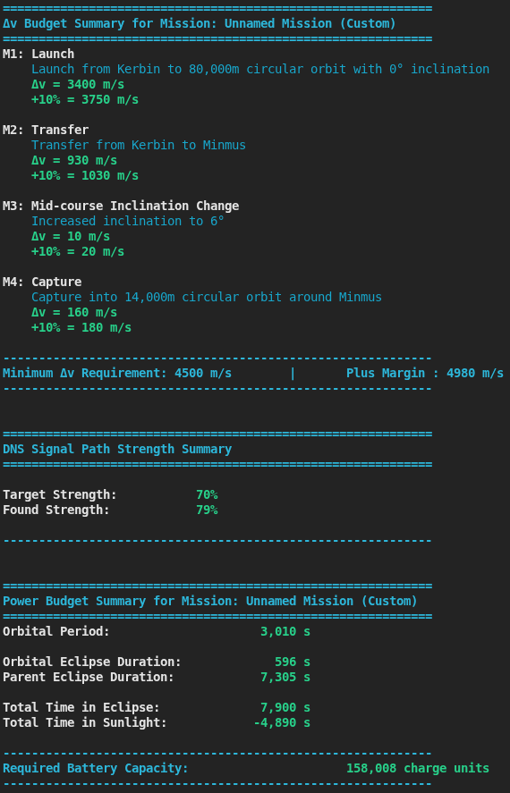

# KSP Flight Planner
---
This project is a Kerbal Space Program mission planning tool. It allows
the user to build a mission, calculate delta-v costs across maneuvers,
model antenna signal strength, and size batteries for spacecraft power
systems. In the future it will also generate a Kerbol Operating System
script to fully automate the flight. The codebase exists to streamline
KSP mission planning with accurate orbital mechanics and comms modeling.

### Execution
To run the project:

```
python src/main.py
```

This runs a demo mission flow and a CommNet demo, printing maneuver
delta-v summaries and antenna signal results. Requires Python 3.8+
and standard libraries. No additional installs needed beyond the base
repo.

# Implemented Features
1. [Mission Builder](#mission-builder): Constructs missions from sequential maneuvers — launch, orbit change, transfer, and landing. Tracks and summarizes delta-v across the full flight plan.
2. [Maneuver Calculators](#maneuver-calculators): Dedicated modules for launch delta-v, Hohmann transfers, coplanar orbit changes, and inclination changes.
3. [Mission Presets](#mission-presets): Predefined missions for Kerbin, Mun, Minmus, and Duna — useful as starting points or reference examples.
4. [Antenna & CommNet Modeling](#commnet-modeling): Models direct and relay antennas, combined signal power, and signal path strength via `CommNet` and `Satellite` classes.
5. [Planetary Body Definitions](#body-models): Full set of KSP body models including Kerbin, Mun, Minmus, Duna, Moho, Kerbol, and more.
6. [Spacecraft & CommNet Registry](#commnet-registry): A completed `Mission` or its resulting `Orbit` object can be attached to a `Spacecraft` and saved to the operational satellites list. This is how the `CommNet` is populated and queried.


# Planned Additions
1. Spacecraft Construction & Power Sizing: Add antennas and power systems to a spacecraft object and get battery sizing recommendations based on selected hardware. The battery calculator will account for solar panel size, time spent in eclipse of the current orbital body, and — where applicable — time spent in the eclipse shadow of that body's parent.
2. KOS Script Generation: Automatically output a Kerbol Operating System script to fully automate the planned flight.
3. Orbit-Origin Missions: Currently all missions must begin from a launch off a planetary surface. A planned addition will allow missions to start from an existing orbit, enabling mid-flight replanning and multi-leg mission chaining.

# High-Level Workflow
The general flow of the planner mirrors a real KSP mission plan:

1. Select a starting body and instantiate a `Mission` object.
2. Chain maneuvers — `Launch`, `Transfer`, `Land`, or orbit changes — onto the mission.
3. Call `print_maneuver_bill()` to get a full delta-v breakdown across all maneuvers.
4. Optionally construct a `CommNet`, add satellites and antennas, and query signal strength along the flight path.
5. Call `mission.complete()` to finalize and retrieve the resulting orbit state.

Battery sizing and KOS script output will slot into step 5 once implemented.
# Example Usage Script
```python
from Missions import Mission 
from utils.import_bodies import *
from models.antenna_models import *
from CommNet import *
from mission_presets import *

if __name__ == "__main__":

  mission = Mission(origin = Kerbin)
  mission.Launch(80_000)
  mission.Transfer(Minmus, 14_000, 14_000)

  mission.print_maneuver_bill()

  orbit = mission.complete()
  commNet = CommNet(tier=2)

  test_sat = Satellite(orbit, 0, commNet.DSN, comm_type='Direct')
  test_sat.add_antenna(Communotron_16)
  commNet.query_signal_strength(test_sat)

  power_usage = Communotron_16.electricity * Communotron_16.speed

  mission.print_power_bill(power_usage)
```
#### Example Output


Use `src/main.py` for a full demo that also creates a `CommNet` and queries antenna signal strength.