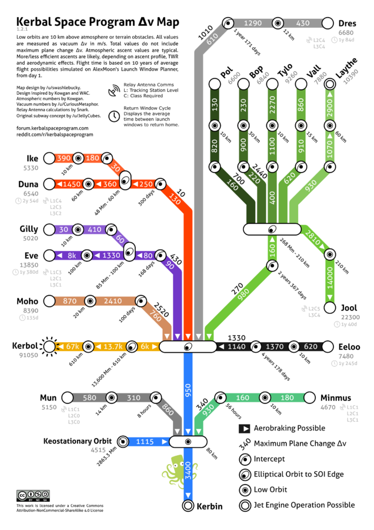

# Body models

This folder contains planetary and moon definitions used by the mission planner.

Each body class defines physical, rotational, atmospheric, and orbital properties.

## `launch_loss_factor`

- `launch_loss_factor` is a fixed delta-v penalty used by `src/maneuvers/launch.py`.
- It represents a rough estimate of atmospheric drag and gravity-turn losses for a real ascent.
- The value is not computed dynamically; it is hardcoded per body in its model file.
- Example values:
  - `Kerbin`: `1000` m/s
  - `Duna`: `430` m/s
  - `Mun`, `Minmus`, `Moho`: `0` m/s

## Why it exists

The launch model calculates an ideal ascent cost and then adds `launch_loss_factor` to approximate the extra delta-v required for a non-ideal, atmospheric launch profile.

### Kerbin example

- Ideal vacuum launch to 80 km with instant acceleration: ~2400 m/s
- Real-world average Kerbin ascent cost: ~3400 m/s
- Difference / launch losses: ~1000 m/s

That is why Kerbin’s body model uses `launch_loss_factor = 1000`.

Average delta-v costs are derived from the Kerbal Space Program delta-v map below, which is available at https://wiki.kerbalspaceprogram.com/wiki/File:KerbinDeltaVMap.png

